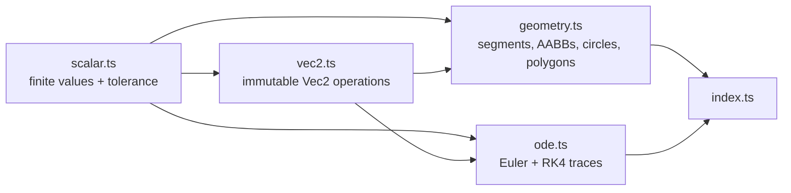

# Math module

`src/math/` is the dependency-free, immutable 2D foundation for the project.
Import its public API from `src/math/index.ts`; callers should not import
implementation files directly. Every public constructor/query either returns a
finite value or an explicit classification/diagnostic—never a hidden `NaN`.

## Contracts

- `types.ts` owns the common immutable value, diagnostic, and `Result<T>`
  vocabulary.
- `scalar.ts` owns the single absolute/relative tolerance policy.
- `vec2.ts` supplies finite vector arithmetic and classifies zero-direction
  normalization/projection instead of dividing by zero.
- `geometry.ts` turns segment, boundary, overlap, and polygon edge cases into
  inspectable result tags.
- `ode.ts` integrates scalar or `Vec2` states with Euler or RK4, returning an
  immutable trace. Invalid solver inputs and derivatives are diagnostics.

The module has no browser, physics, random, clock, or scene dependency.
